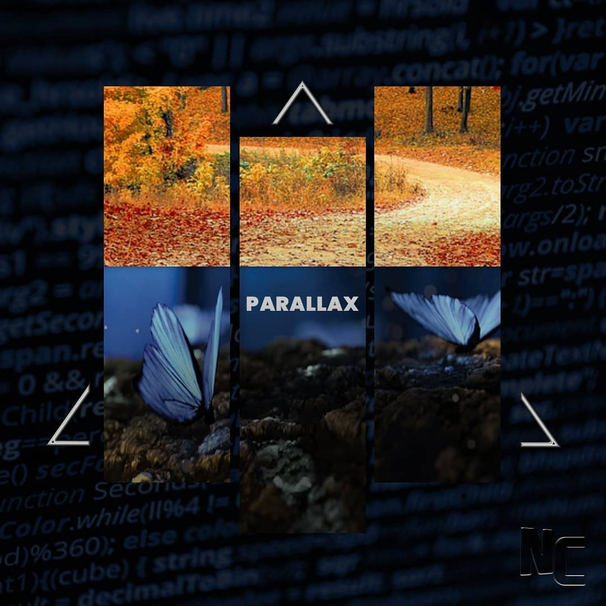
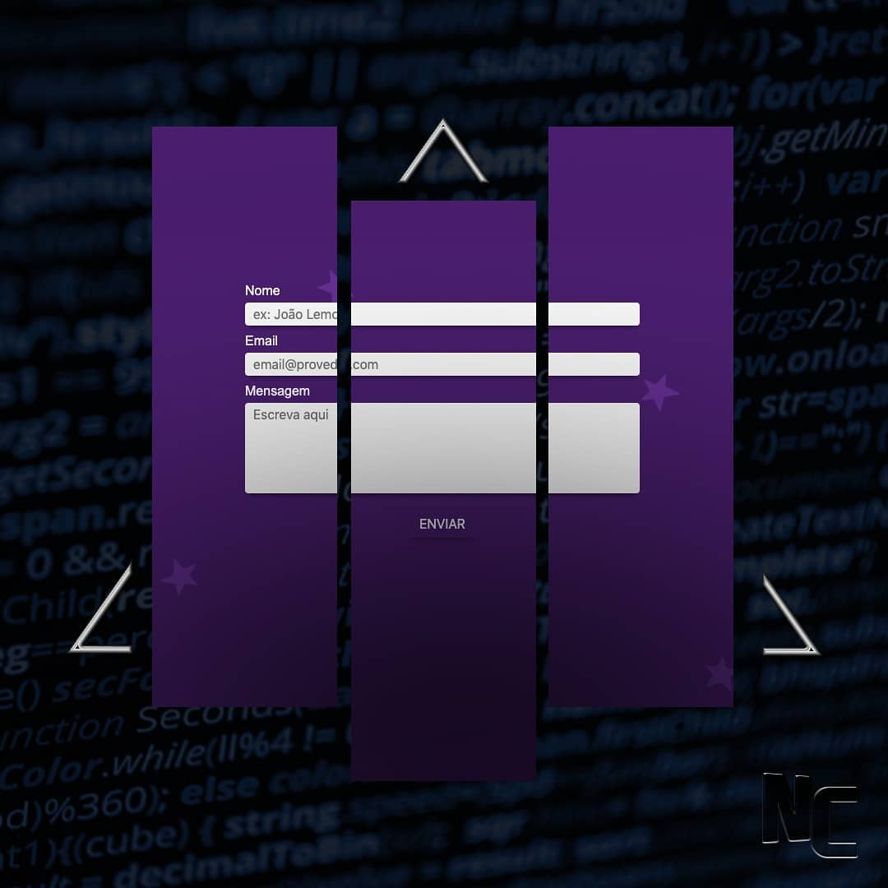
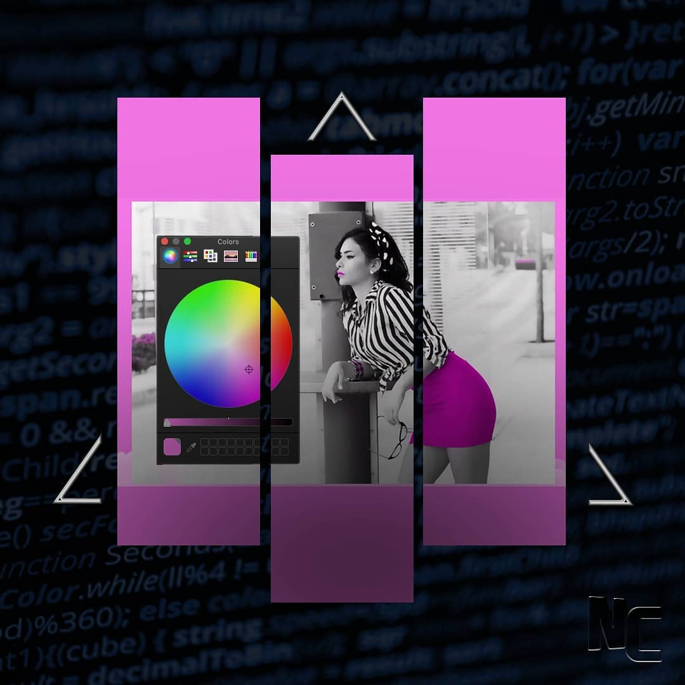
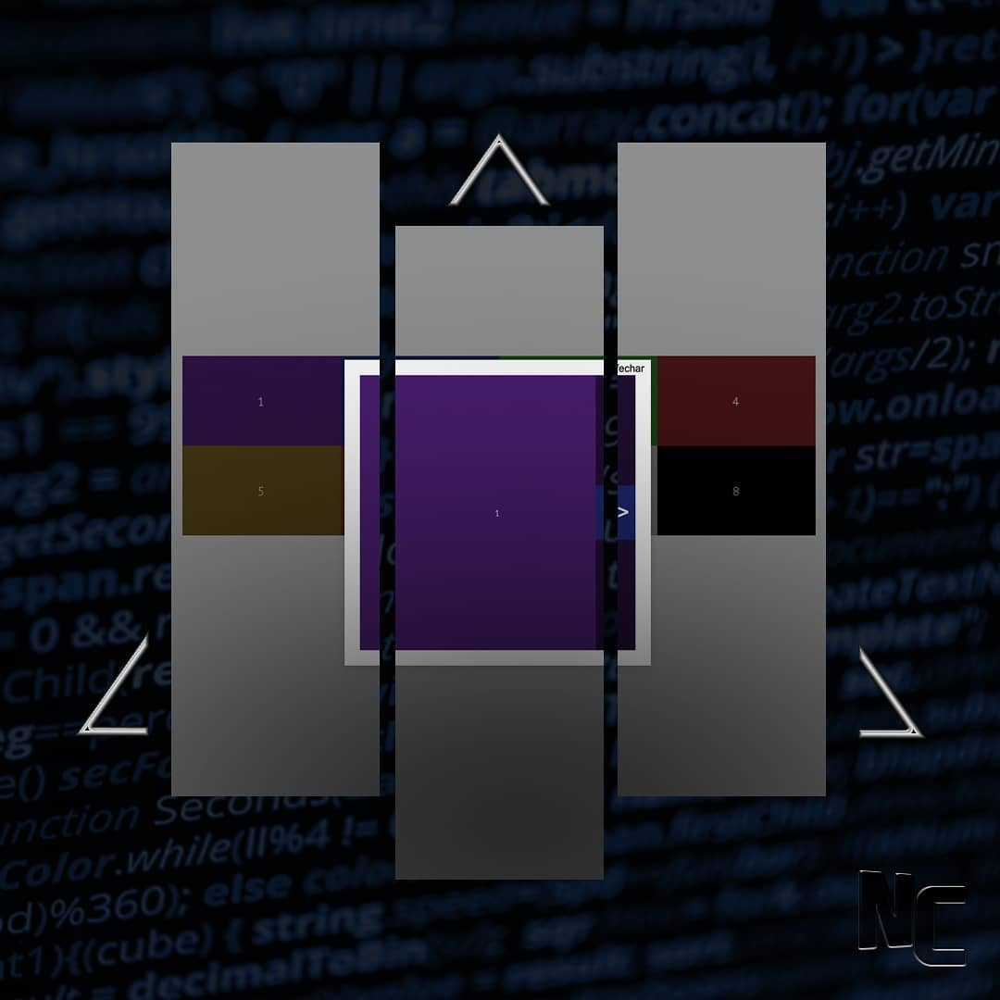
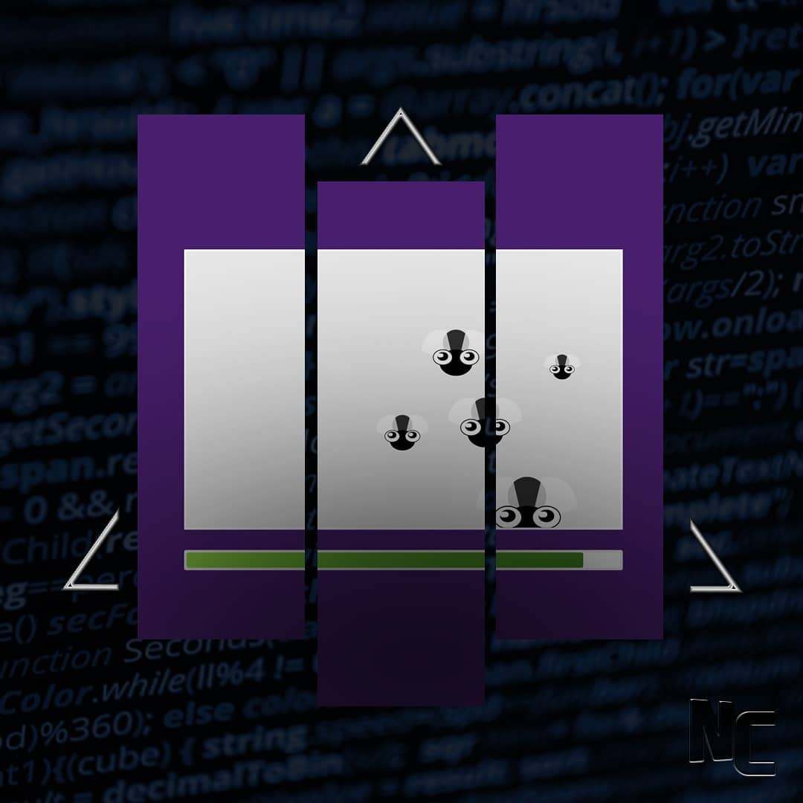
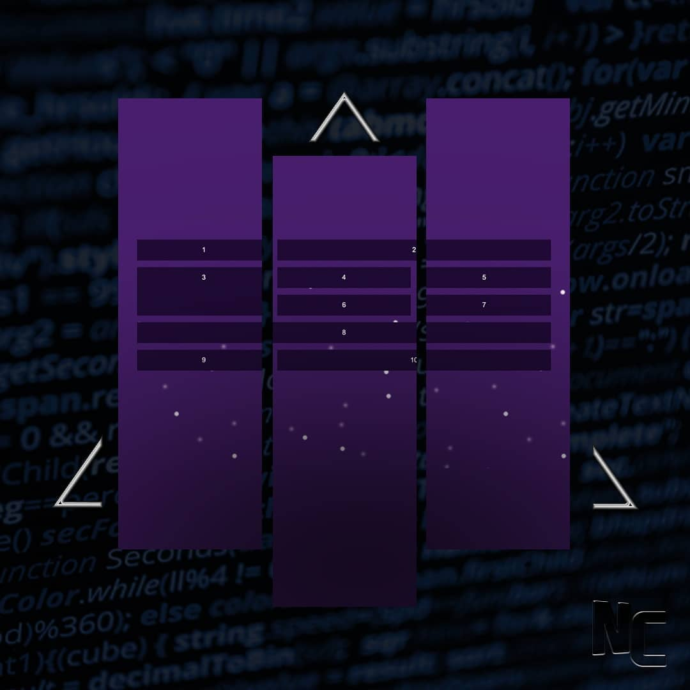
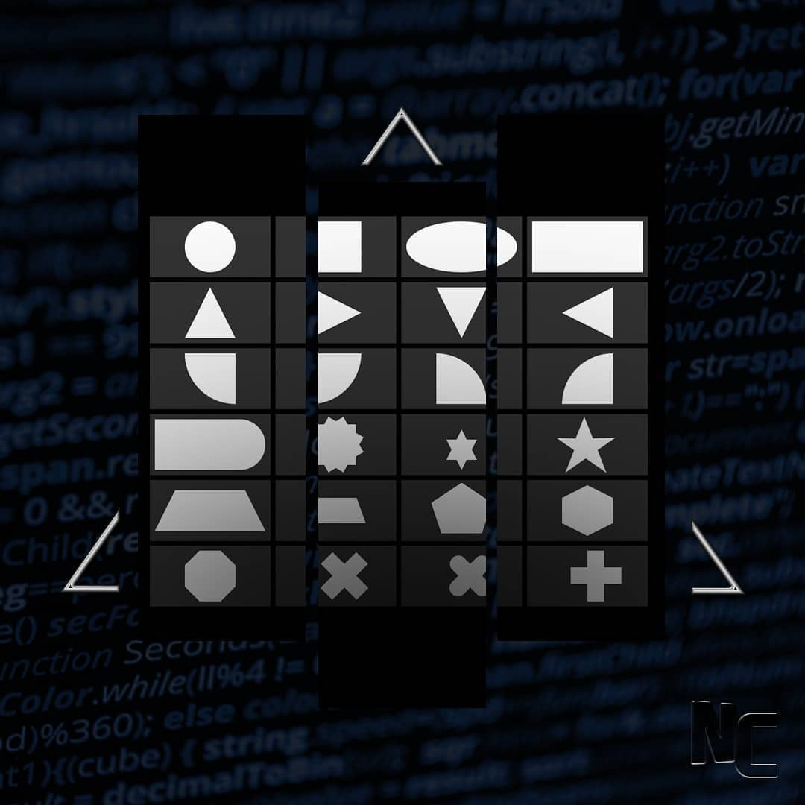
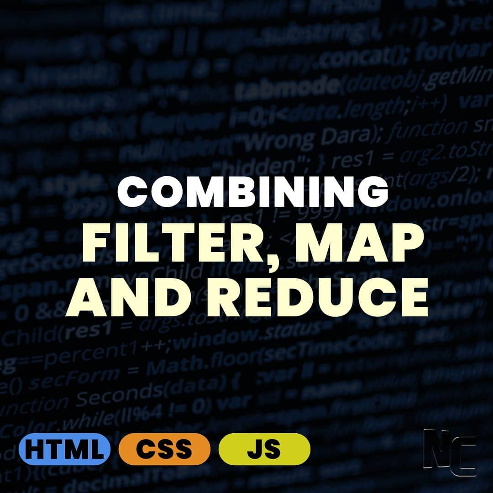
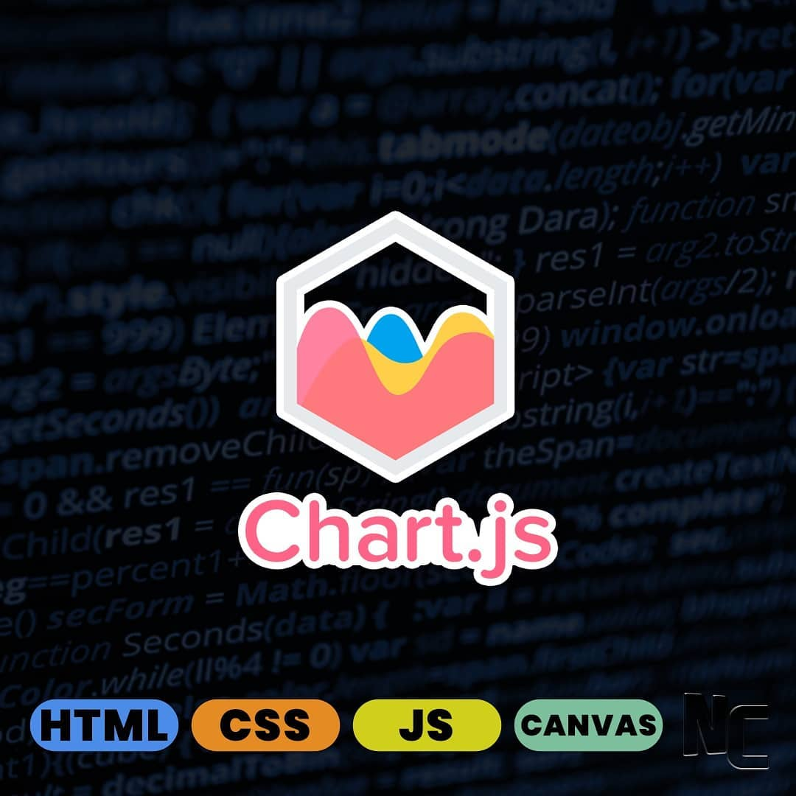
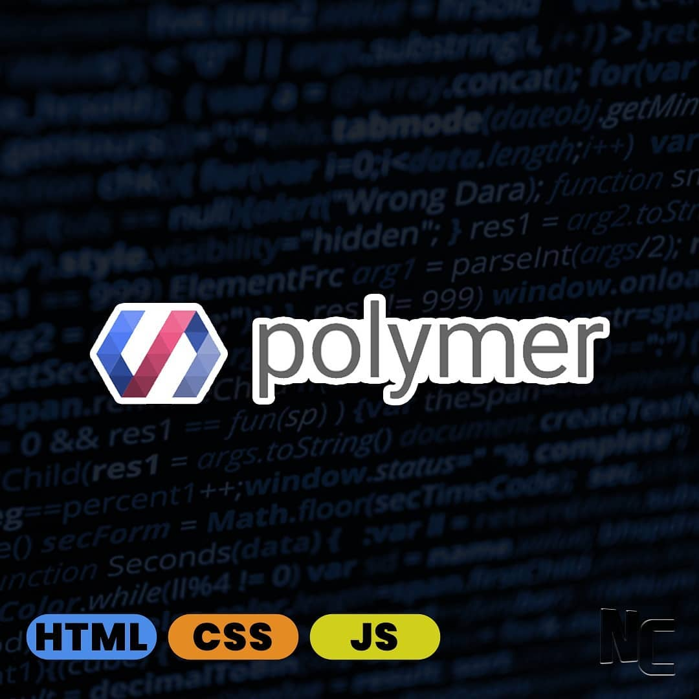

# 92 Days of Code - 2019

## Codes

### HTML & CSS

|| Preview ||
|:-------------- |:--------------:| :--------------|
|Day 1 |  | [Smile](./day-1/) |
|Day 2 |  | [Movie Card With Hover Effect](./day-2/) |
|Day 3 |  | [Pacman Loader](./day-3/)
|Day 4 |  | [Smartphone With Slide Left Transition](./day-4/)
|Day 5 |  | [Compass](./day-5/)
|Day 6 |  | [Bar Chart](./day-6/)
|Day 7 |  | [Data Filter](./day-7/)
|Day 8 |  | [Circular Menu](./day-8/)
|Day 9 |  | [Target Game](./day-9/)
|Day 10 |  | [Calendar - CSS Grid](./day-10/)
|Day 11 |  | [Carousel Autoplay](./day-11/)
|Day 12 |  | [Slider](./day-12/)
|Day 13 |  | [Neon Text Effect](./day-13/)
|Day 14 |  | [Responsive Table](./day-14/)
|Day 15 |  | [Button Ripple Effect](./day-15/)
|Day 16 |  | [Slide Tab Bar](./day-16/)
|Day 17 |  | [Animated Accordion](./day-17/)
|Day 18 |  | [Wave Text Animation](./day-18/)
|Day 19 |  | [Flip Card](./day-19/)
|Day 20 |  | [Custom Toggle Switch](./day-20/)
|Day 21 |  | [Tooltip with aria-label](./day-21/)
|Day 22 |  | [Social Media Animation](./day-22/)
|Day 23 |  | [Parallax Effect](./day-23/)
|Day 24 |  | [Simple form](./day-24/)
|Day 25 |  | [Experiment with color input type](./day-25/)
|Day 26 |  | [Gallery with Modal](./day-26/)
|Day 27 |  | [Kill Fly Game](./day-27/)
|Day 28 |  | [CSS Grid Layout](./day-28/)
|Day 29 |  | [Pure CSS Shapes](./day-29/)
|Day 30 |  | [Animation](./day-30/)

### HTML, CSS, SVG, Canvas & JavaScript

|| Preview |||
|:-------------- |:--------------:| :--------------| :--------------|
|Day 31 |  | [Creating a pyramid](./day-31/) | `html` `css` `js`
|Day 32 |  | [Interactive workstation](./day-32/) | `html` `css` `svg` `js`
|Day 33 |  | [Combining Filter, Map and Reduce](./day-33/) | `html` `css` `js`
|Day 34 |  | [Fibonacci Sequence](./day-34/) | `html` `css` `js`
|Day 35 |  | [Playing with array - Push, Pop, Unshift and Shift](./day-35/) | `html` `css` `js`
|Day 36 |  | [Webstorage: sessionStorage and LocalStorage](./day-36/) | `html` `css` `js`
|Day 37 |  | [Playing with array - Splice, Slice, ToString and Join](./day-37/) | `html` `css` `js`
|Day 38 |  | [Pagination](./day-38/) | `html` `css` `js`
|Day 39 |  | [Playing with array - Concat, Sort, Reverse and ForEach](./day-39/) | `html` `css` `js`
|Day 40 |  | Credicard validator (./day-40/) | `html` `css` `js`
|Day 41 |  | Playing with array - Includes, IndexOf, LastIndexOf, Find and FindIndex (./day-41/) | `html` `css` `js`
|Day 42 |  | Cookies (./day-42/) | `html` `css` `js`
|Day 43 |  | Playing with array - Some, Every, Array.from and Array.of (./day-43/) | `html` `css` `js`
|Day 44 |  | Calculator (./day-44/) | `html` `css` `js`
|Day 45 |  | NodeJS - Server-side JavaScript (./day-45/) | `html` `css` `js`
|Day 46 |  | Playing with array - Entries, copyWithin, fill and reduceRight (./day-46/) | `html` `css` `js`
|Day 47 |  | Data Structures in JS: Primitives (./day-47/) | `html` `css` `js`
|Day 48 |  | Data Structures in JS: Array (./day-48/) | `html` `css` `js`
|Day 49 |  | Data Structures in JS: Stacks (./day-49/) | `html` `css` `js`
|Day 50 |  | Data Structures in JS: Queue ?& Priority Queue (./day-50/) | `html` `css` `js`
|Day 51 |  | Data Structures in JS: Linked List (./day-51/) | `html` `css` `js`
|Day 52 |  | Data Structures in JS: Sets (./day-52/) | `html` `css` `js`
|Day 53 |  | Data Structures in JS: Hash Table (./day-53/) | `html` `css` `js`
|Day 54 |  | Data Structures in JS: Trie (./day-54/) | `html` `css` `js`
|Day 55 |  | Data Structures in JS: Tree (Binary Search Tree, AVL Tree) (./day-55/) | `html` `css` `js`
|Day 56 |  | Data Structures in JS: Heap (./day-56/) | `html` `css` `js`
|Day 57 |  | Data Structures in JS: Graph (both directed and undirected) (./day-57/) | `html` `css` `js`
|Day 58 |  | Algorithms in JS: Sorting (./day-58/) | `html` `css` `js`
|Day 59 |  | Algorithms in JS: Searching (./day-59/) | `html` `css` `js`
|Day 60 |  | Algorithms in JS: Designs (./day-60/) | `html` `css` `js`

### Libraries & Frameworks

|| Preview |||
|:-------------- |:--------------:| :--------------| :--------------|
|Day 61 |  | MochaJS (./day-61/) |
|Day 62 |  | Jasmine (./day-62/) |
|Day 63 |  | AVA (./day-63/) |
|Day 64 |  | Jest (./day-64/) |
|Day 65 |  | ChaiJS and SinonJS (./day-65/) |
|Day 66 |  | Karma (./day-66/) |
|Day 67 |  | Nightwatch (./day-67/) |
|Day 68 |  | Three.js (./day-68/) |
|Day 69 |  | Anime.js (./day-69/) |
|Day 70 |  | Mo.js (./day-70/) |
|Day 71 |  | Velocity (./day-71/) |
|Day 72 |  | Popmotion (./day-72/) |
|Day 73 |  | D3.js (./day-73/) |
|Day 74 |  | Google Charts (./day-74/) |
|Day 75 |  | ChartJS (./day-75/) |
|Day 76 |  | Mustache.js (./day-76/) |
|Day 77 |  | JQuery (./day-77/) |
|Day 78 |  | DojoJS (./day-78/) |
|Day 79 |  | Ext.JS (./day-79/) |
|Day 80 |  | TaffyDB (./day-80/) |
|Day 81 |  | MeteorJS (./day-81/) |
|Day 82 |  | Polymer (./day-82/) |
|Day 83 |  | Gatsby (./day-83/) |
|Day 84 |  | Aurelia (./day-84/) |
|Day 85 |  | Angular (./day-85/) |
|Day 86 |  | Vue (./day-86/) |
|Day 87 |  | React (./day-87/) |
|Day 88 |  | Machine Learning 1 (./day-88/) |
|Day 89 |  | Machine Learning 2 (./day-89/) |
|Day 90 |  | Machine Learning 3 (./day-90/) |

### 

|| Preview |||
|:-------------- |:--------------:| :--------------| :--------------|

|Day 91 |  |  |
|Day 92 |  |  |

## Contributing

- Fork it!
- Create your feature branch: `git checkout -b my-new-feature`
- Commit your changes: `git commit -m 'Add some feature'`
- Push to the branch: `git push origin my-new-feature`
- Submit a pull request

## Log

Check [Releases](https://github.com/hemersonvianna/daysofcode/releases) for detailed changelog.

## License

[MIT license](http://hemersonvianna.mit-license.org/) © Hemerson Vianna
